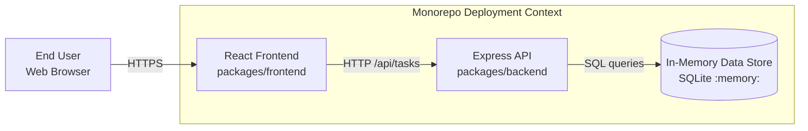
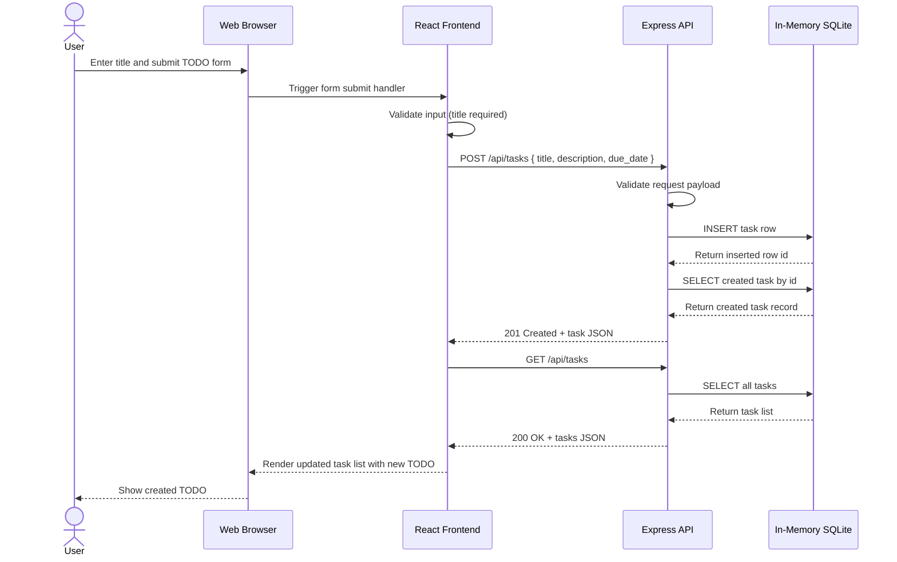

# Cloud Architecture Overview

This document provides a simple system context view for the TODO app monorepo.

## System Context

## Notes

- The React frontend is the user-facing web application.
- The Express API exposes task endpoints used by the frontend.
- Data is stored in an in-memory SQLite database and resets when the backend process restarts.
- This is a simple logical system context and not a production cloud deployment topology.

## Sequence: User Creates a TODO

